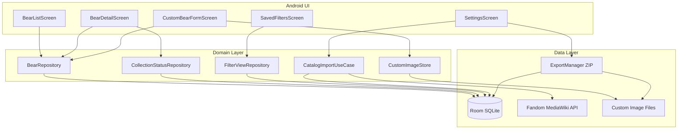
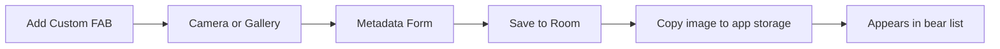
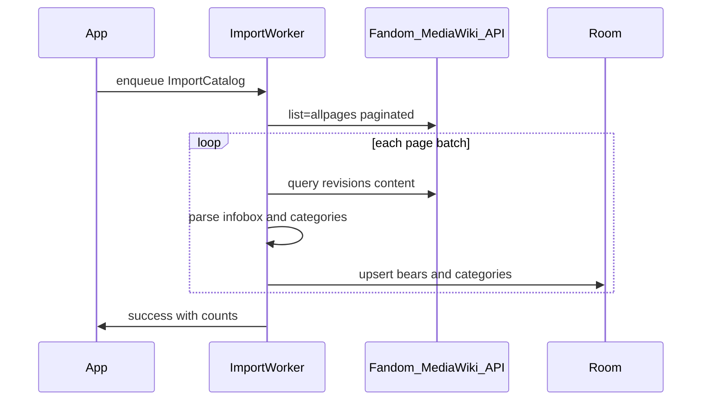

# Build-A-Bear Collection Tracker — Implementation Plan

## Goals (v1)

- Browse a searchable list of Build-A-Bears with thumbnail, name, and your status badge
- Open a detail screen with imported metadata and images
- Tag each bear: **Owned**, **Want**, **Don't want** (or unset)
- **Add custom Build-A-Bears** with a photo (camera or gallery) and self-entered metadata
- Create **saved filtered views** (e.g. "2024 white bears I want")
- **Import catalog metadata** from existing online databases
- Store collection tags and custom entries **locally**; **export** catalog-tagged bears and custom entries together (no cloud sync in v1)

## Recommended Stack

| Layer | Choice | Why |
|-------|--------|-----|
| UI | Jetpack Compose + Material 3 | Native Android, fast list/filter UX |
| Architecture | MVVM + Repository | Clear separation for import vs. user data |
| Local DB | Room (SQLite) | Offline-first, good for filters and export |
| DI | Hilt | Standard Android wiring |
| Images | Coil + CameraX + Photo Picker | Remote wiki URLs + local custom bear photos |
| Networking | Retrofit + OkHttp | MediaWiki API calls |
| File storage | App-internal `files/custom-images/` | Custom photos survive app restarts; included in export ZIP |
| Background import | WorkManager | Periodic/manual catalog refresh without blocking UI |
| Project location | `C:\Users\blong\dev\build-a-bear-tracker` | New greenfield project (no existing repo) |

You have an `.android` SDK folder, so native Android development is already feasible on this machine.

## Data Sources (what exists online)

There is **no official public Build-A-Bear catalog API**. Practical sources:

### Primary: [Build-a-Bear Workshop Wiki (Fandom)](https://buildabear.fandom.com)

- ~1,100+ article pages, community-maintained, includes retired items
- Exposes a **MediaWiki API** (preferred over HTML scraping)
- Many plush pages use a structured `{{Build-A-Bear}}` infobox with fields like:
  - `year_released`, `fur_color`, `eye_color`, `height`, `weight`, `sku`, `price`, `available`, `image1`
- Categories provide extra facets: `Category:Animals`, `Category:Christmas`, `Category:Mini Beans`, release-year categories, etc.

Example infobox fields from the Glisten page (via API):

```
eye_color=Blue
height=15 Inches
sku=031892
year_released=2015-2023
fur_color=White
available=Yes
price=$32.00 ...
```

### Secondary (v1.1+): [buildabear.com](https://www.buildabear.com)

- ~700+ current products with filters (color, collection, occasion)
- Runs on Salesforce Commerce Cloud; **no public API**
- Useful later for **current availability/price** enrichment, but HTML/OCAPI scraping is brittle and may conflict with site terms — treat as optional Phase 3, not v1 blocker

### Tertiary: [buildabearwiki.info](https://buildabearwiki.info)

- Another community wiki with year-based categories
- API endpoint returned 404 in testing; may require HTML parsing or manual export — defer unless needed

**v1 recommendation:** Import from **Fandom MediaWiki API only**. It has the richest historical catalog and machine-readable structure.

## Architecture



## Data Model

### Unified `bears` table (catalog + custom)

One table holds both imported catalog entries and user-created custom bears. Discriminate with `sourceType`.

**`bears`** — one row per bear (catalog or custom)

- `id` (UUID; catalog entries also store `externalId` = wiki pageid)
- `sourceType` enum: `CATALOG` | `CUSTOM`
- `name` (required), `slug`, `description`
- `yearReleased` (string; may be ranges like "2015-2023")
- `furColor`, `eyeColor`, `height`, `weight`, `sku`, `price`, `available`
- `imageUrls` (JSON list — remote URLs for catalog bears)
- `localImagePath` (nullable — app-internal file path for custom bears)
- `sourceUrl`, `sourceName` ("fandom" for catalog; null for custom)
- `extraMetadataJson` (optional user-defined key/value pairs on custom bears)
- `importedAt`, `updatedAt`, `createdAt`

**Custom vs. catalog behavior:**

| Action | Catalog (`CATALOG`) | Custom (`CUSTOM`) |
|--------|---------------------|-------------------|
| Edit metadata | No (refreshed by wiki sync) | Yes |
| Delete | No | Yes (also deletes local image file) |
| Default status | Unset | Defaults to **Owned** (user is adding their own plush) |
| Wiki sync overwrite | Yes (preserves `collection_status`) | Never touched by sync |

**`bear_categories`** — many-to-many

- `bearId`, `category` (e.g. "Reindeer", "Christmas", "Mini Beans")

**`import_runs`** — audit trail for sync

- `startedAt`, `finishedAt`, `pagesFetched`, `errors`

### User tables (your collection)

**`collection_status`**

- `bearId` (FK)
- `status` enum: `UNSET`, `OWNED`, `WANT`, `DONT_WANT`
- `notes` (optional, for "owned" details like condition/date acquired)
- `updatedAt`

**`saved_filters`**

- `id`, `name`, `criteriaJson`, `sortOrder`, `createdAt`

Example `criteriaJson`:

```json
{
  "status": ["WANT"],
  "yearReleased": { "contains": "2024" },
  "furColor": ["White"],
  "categories": ["Christmas"],
  "available": true,
  "sourceType": ["CUSTOM"]
}
```

## Custom Bear Entry

Users can add bears not found in the wiki catalog — one-offs, heavily customized workshop creations, or mislabeled imports.



### Photo capture

- **Camera** — CameraX `Preview` + `ImageCapture`; write JPEG to temp file, then copy to `files/custom-images/{bearId}.jpg`
- **Gallery** — Android Photo Picker (`PickVisualMedia`) on API 33+; `GetContent` fallback on older devices
- **Permissions** — request `CAMERA` when taking photos; Photo Picker avoids broad storage permission on modern Android
- **Replace photo** — edit flow allows retaking or re-importing; old file deleted on replace

### Metadata form fields

| Field | Required | Notes |
|-------|----------|-------|
| Name | Yes | Primary display label |
| Photo | Yes | At least one image |
| Year released | No | Free text |
| Fur color | No | Text or picker seeded from existing distinct values |
| Eye color | No | Same |
| Height / Weight | No | Free text (e.g. "15 Inches") |
| SKU | No | Optional identifier |
| Price | No | Free text |
| Description / Notes | No | Multi-line |
| Tags / Categories | No | Comma-separated or chip input; stored in `bear_categories` |

Custom entries use the same metadata columns as catalog bears so they participate in search and saved filters without special cases.

### List and detail UX for custom bears

- **"Custom" badge** on list cards (distinct from catalog entries)
- Detail screen shows **Edit** and **Delete** actions (catalog entries show "View on wiki" instead)
- Delete confirms via dialog; removes bear row, categories, status, and image file
- FAB on list screen: **"Add custom bear"**

## Catalog Import Pipeline

Do **not** run heavy scraping on the main thread. Use WorkManager for background import.



### Import steps

1. **List pages** — `action=query&list=allpages&apnamespace=0` (paginate with `apcontinue`)
2. **Fetch wikitext** — `action=query&prop=revisions` in batches (~50 titles)
3. **Parse** — extract `{{Build-A-Bear|...}}` template fields with a lightweight parser; fall back to page title + first image + categories when infobox missing
4. **Categories** — `action=query&prop=categories` per page; keep `Category:*` minus meta categories
5. **Upsert** — match on `pageid` or normalized title; preserve user `collection_status` rows; **never modify or delete `sourceType=CUSTOM` rows**
6. **Rate limit** — 1 req/sec, exponential backoff, User-Agent identifying personal collector app
7. **Bootstrap** — ship a small prebuilt seed JSON (~100 popular bears) so first launch is instant before first sync

### Parser scope (v1)

Parse these infobox keys when present: `year_released`, `fur_color`, `eye_color`, `height`, `weight`, `sku`, `price`, `available`, `image1`. Store unknown keys in a `extraMetadataJson` column for future filter expansion without schema churn.

## UI Screens

### 1. Bear List (main)

- `LazyColumn` of cards: thumbnail, name, year, status chip, **Custom badge** when applicable
- Top: search bar (name/SKU)
- Filter bar: quick chips for status, year, color, **source (Catalog / Custom / All)**
- **FAB: "Add custom bear"** (primary add action)
- Secondary action: "Saved views" picker
- Pull-to-refresh triggers incremental catalog sync (catalog only)

### 2. Bear Detail

- Image carousel (Coil for remote URLs; local `file://` for custom photos)
- Metadata sections: Release, Appearance, Identifiers, Availability
- Category chips (tappable → apply as filter)
- Segmented control or 3-button toggle: Owned / Want / Don't want
- Optional notes field (owned only)
- **Catalog:** link to source wiki page
- **Custom:** Edit and Delete buttons in top app bar

### 3. Custom Bear Form (add / edit)

- Photo area with "Take photo" and "Choose from gallery" buttons; shows preview
- Scrollable form with all metadata fields above
- Save validates name + photo present
- Cancel discards unsaved changes (confirm if dirty)

### 4. Saved Filter Views

- List of named views with live count badge
- Create/Edit filter builder:
  - Status (multi-select)
  - Year released (text or range)
  - Fur color / eye color (multi-select from distinct DB values)
  - Categories (multi-select)
  - Available (yes/no/any)
- Save view → appears in list screen picker

### 5. Settings

- "Sync catalog from wiki" (manual + last sync time)
- **"Export my collection"** → ZIP file via Android share sheet containing:
  - `collection.json` — all bears with status, metadata, and `sourceType`
  - `images/{bearId}.jpg` — custom bear photos (catalog bears reference remote URLs in JSON)
- **"Import backup"** (v1.1) — restore from exported ZIP
- Attribution: "Catalog data from Build-a-Bear Workshop Wiki (Fandom), CC-BY-SA"

### Export format (v1)

```json
{
  "exportVersion": 1,
  "exportedAt": "2026-06-05T12:00:00Z",
  "bears": [
    {
      "id": "uuid",
      "sourceType": "CUSTOM",
      "name": "My Workshop Bear",
      "yearReleased": "2019",
      "furColor": "Brown",
      "status": "OWNED",
      "notes": "Gift from mom",
      "categories": ["Bears", "Personal"],
      "localImage": "images/uuid.jpg"
    }
  ]
}
```

ZIP export ensures custom photos are portable; JSON-only export would lose images.

## Filtering Implementation

- Build Room queries dynamically from `criteriaJson`
- Distinct-value queries populate filter pickers: `SELECT DISTINCT furColor FROM bears WHERE furColor IS NOT NULL`
- Combine catalog filters with `collection_status` via SQL `JOIN` or Room `@Relation` + in-memory filter for complex criteria
- Default views shipped: "All", "Owned", "Want list", "Don't want", **"My custom bears"**
- Custom bears appear in all relevant filters (year, color, status) same as catalog entries

## Project Structure

```
build-a-bear-tracker/
  app/src/main/java/.../
    data/
      local/       # Room entities, DAOs, Database
      remote/      # MediaWikiApi, DTOs
      repository/  # BearRepository, ImportRepository
    domain/
      model/       # Bear, CollectionStatus, FilterCriteria
      usecase/     # ImportCatalog, ExportCollection
    ui/
      list/        # BearListScreen, ViewModel
      detail/      # BearDetailScreen, ViewModel
      custom/      # CustomBearFormScreen, CameraCapture, ViewModel
      filters/     # SavedFiltersScreen, FilterBuilder
      settings/    # SettingsScreen
    data/
      storage/     # CustomImageStore — save, delete, resolve paths
    worker/        # CatalogImportWorker
    di/            # Hilt modules
  tools/
    seed-catalog/  # Optional Kotlin script to generate bundled seed JSON
```

## Phased Delivery

### Phase 1 — Core app + custom entries (MVP)

- Android project scaffold (Compose, Room, Hilt, Navigation, CameraX)
- Room schema + repositories (unified bears table with `sourceType`)
- Bear list + detail screens
- Status tagging (Owned / Want / Don't want)
- **Custom bear add/edit/delete with camera + gallery photo**
- **Custom image storage + display in list/detail**
- Bundled seed catalog JSON for offline first launch
- Basic text search

### Phase 2 — Wiki import + filters + export

- MediaWiki API client + infobox parser
- WorkManager catalog sync (manual trigger + progress UI; skips custom rows)
- Filter builder + saved views (including "My custom bears" and sourceType filter)
- Category chips and dynamic filter options
- **ZIP export** of collection status + custom bears with images

### Phase 3 — Polish

- Import backup from ZIP (restore)
- CSV export option
- Image caching improvements, empty/error states
- Incremental sync (only pages changed since last import)
- Optional buildabear.com enrichment for current price/stock (evaluate ToS first)

## Risks and Mitigations

| Risk | Mitigation |
|------|------------|
| Wiki pages lack infobox | Fallback metadata from title, categories, first image |
| Inconsistent `year_released` formats | Store raw string; parse ranges in filter logic |
| Fandom rate limits / API changes | Batch requests, backoff, versioned parser, bundled seed fallback |
| Scraping buildabear.com breaks | Keep as optional enrichment, not core dependency |
| Large image load on mobile data | Coil disk cache; Wi‑Fi-only sync setting |
| Custom photos lost on uninstall | ZIP export for backup; document export in onboarding |
| Camera permission denied | Fall back to gallery-only; show rationale dialog |
| Export missing custom images | ZIP bundles `images/` folder alongside JSON |

## Legal / Attribution

- Use the **documented MediaWiki API**, not aggressive HTML scraping
- Display attribution and link to source articles (CC-BY-SA on Fandom)
- Personal collector use; do not redistribute scraped images as a commercial catalog

## Success Criteria for v1

- App launches offline with seed data and shows a browsable list
- User can tag any bear and see status persist across restarts
- User can create a saved view like "2024 + Want + White" and get correct results
- Manual "Sync catalog" imports additional bears from Fandom and updates metadata without wiping collection tags
- User can add a custom bear with a camera or gallery photo and manual metadata
- Custom bears appear in the list, are editable/deletable, and participate in filters
- User can export tagged collection **and custom entries** to a ZIP file (JSON + images)
- Wiki sync never overwrites or deletes custom entries
